# Memoir Engine V1 — System Design

> Bộ nhớ đáng tin có truy vết nguồn (provenance-first memory). Mọi sơ đồ dưới đây phản ánh code đã land trong M1–M6 — không phải tương lai, không phải mong muốn.

Đọc kèm: [`README.md`](../README.md) là phần lý do (§1 Nguyên tắc, §7 Roadmap, §9 Rủi ro). File này là phần như-thế-nào — cấu trúc, dòng dữ liệu, ràng buộc.

---

## 1. Pipeline tổng quan

Step 1–7 theo §3 README, ánh xạ vào module Python thực tế. Mọi tầng phía dưới đều **trỏ ngược về substrate**: không có sinh prose nào chạm tới generation trước khi qua review.

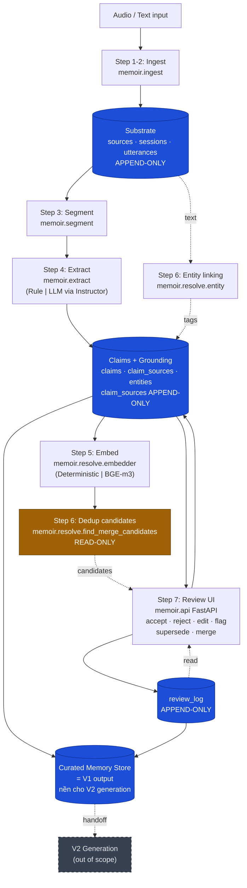

**Quy ước:**
- Xanh đậm = bảng dữ liệu (Postgres).
- Vàng = đường đọc-only (không bao giờ commit).
- Xám gạch nét đứt = ngoài phạm vi V1.

---

## 2. Data model (§4 schema)

ER diagram cho 8 bảng nghiệp vụ + `alembic_version`. Ghi rõ cột nào append-only, FK nào load-bearing.

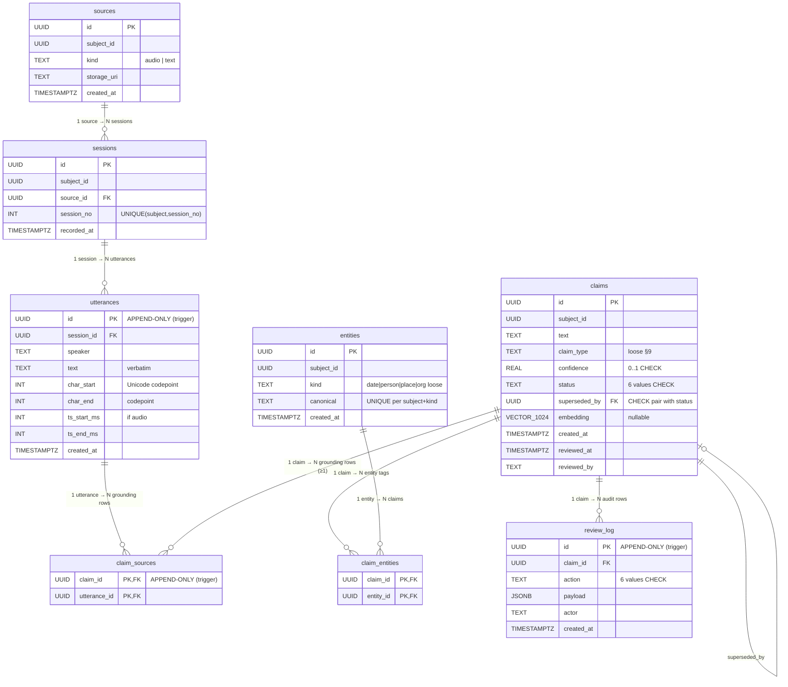

**3 bảng append-only ở tầng DB:** `utterances`, `claim_sources`, `review_log` — Postgres trigger fire `BEFORE UPDATE` và `BEFORE DELETE` ở mỗi bảng, raise `EXCEPTION ... ERRCODE='check_violation'` (map sang SQLAlchemy `IntegrityError`).

---

## 3. Vòng đời một Claim

Mỗi action điều chỉnh `claims.status` AND viết 1 row vào `review_log` trong cùng 1 transaction. Không có path nào mutate claim mà không audit.

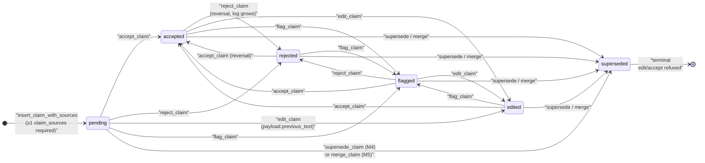

**Nguyên tắc §1 *"đảo ngược được"*:** mọi state có thể đi qua mọi state khác (trừ `superseded` là một-chiều). Mỗi transition thêm row mới vào `review_log`, không bao giờ ghi đè.

**`superseded` là terminal** vì:
- `edit_claim` refuse (M4 invariant): historic claim không được sửa text, dùng supersede chain để thêm phiên bản mới.
- `accept_claim` refuse: successor mới là claim hiện tại của narrative.

---

## 4. Append-only — phòng thủ 4 lớp

Quy tắc cứng §4 *"Insert claim mà không có ít nhất 1 dòng claim_sources → từ chối"* không phải 1 ràng buộc duy nhất — nó được defend ở mọi tầng:

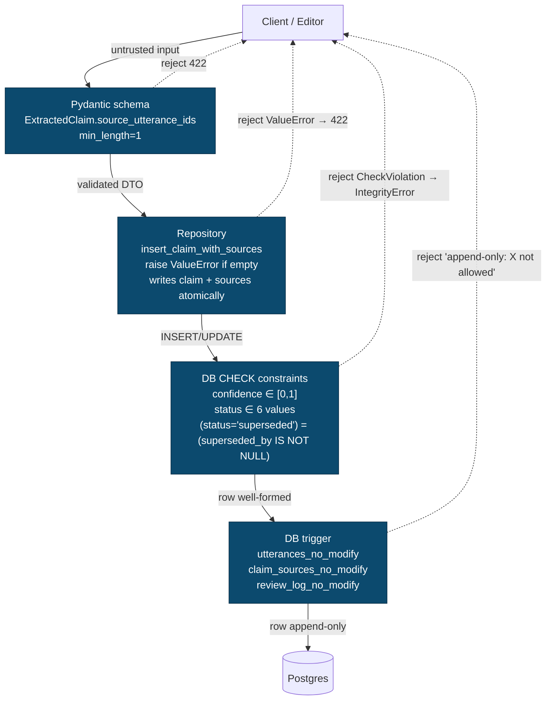

**Triết lý:** 1 tầng có thể quên/bug; 4 tầng cùng vỡ thì coi như hệ thống không vận hành. Cost rất thấp vì mỗi tầng chỉ vài dòng code.

---

## 5. Pipeline flows — sequence diagrams

### 5.1. M1: Ingestion (text path)

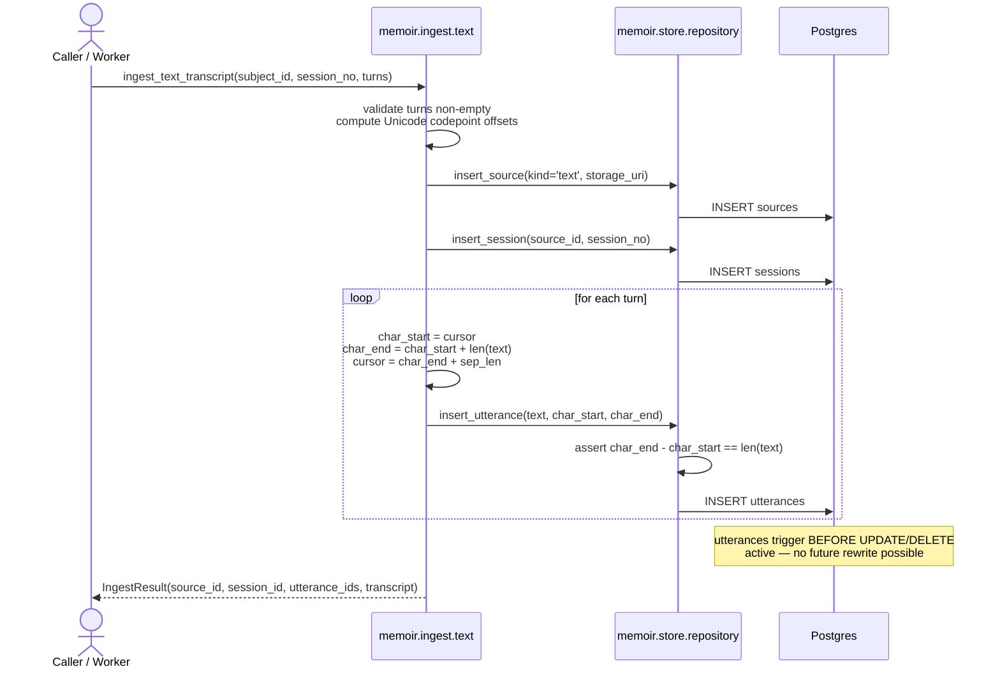

### 5.2. M2: Grounded extraction

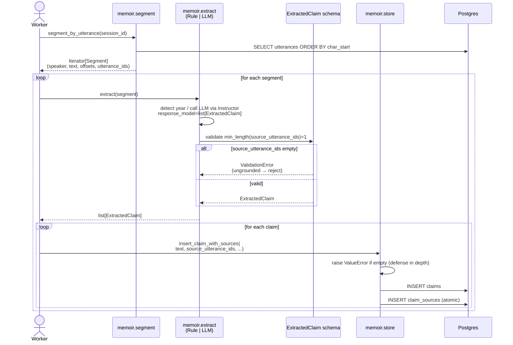

### 5.3. M3: Editor review

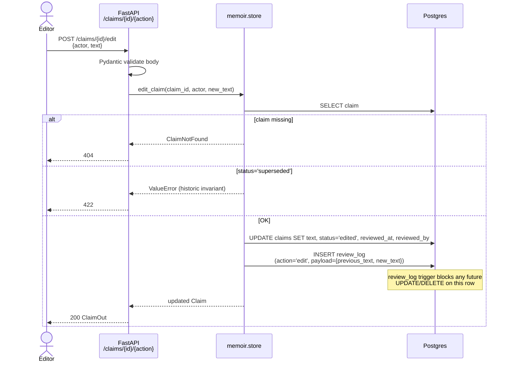

### 5.4. M4: Correction (subject self-corrects in a later session)

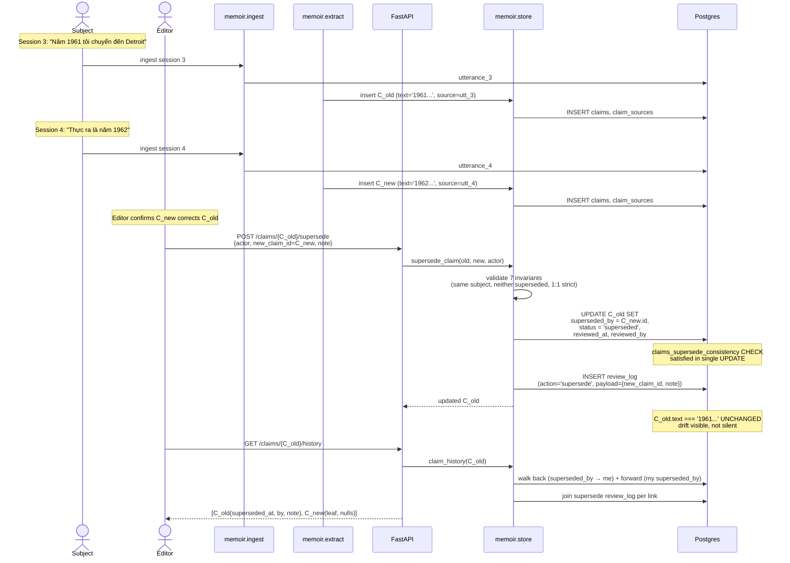

### 5.5. M5: Dedup + merge

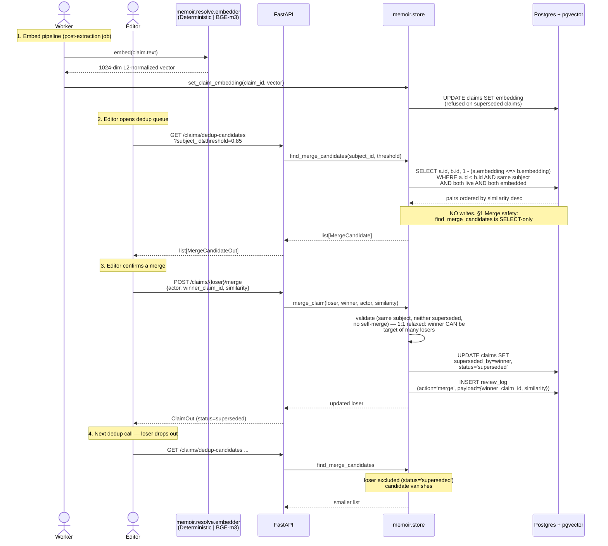

### 5.6. M6: Provenance audit

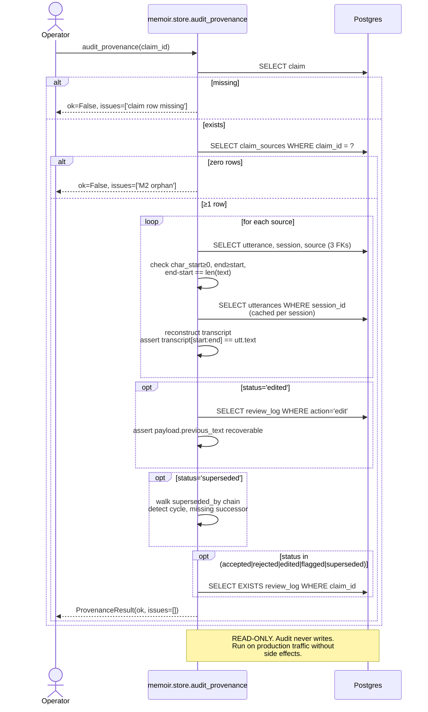

---

## 6. Module layout

Package boundary phản ánh pipeline step. Mỗi module có 1 protocol cho interface + ≥1 implementation; production-grade impl thường lazy-import heavy deps.

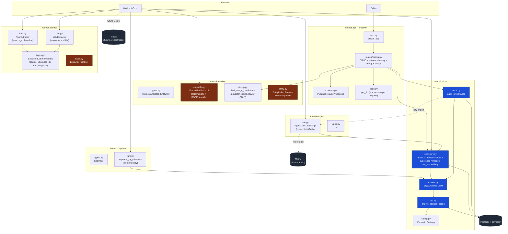

---

## 7. API surface (M3–M5)

| Method | Path | Hành động | Body / Query |
|--------|------|-----------|--------------|
| `GET` | `/healthz` | health check | — |
| `GET` | `/claims` | list, có grounding inline | `?status=&subject_id=&limit=&offset=` |
| `GET` | `/claims/dedup-candidates` | gợi ý merge, **read-only** | `?subject_id=&threshold=&limit=` |
| `GET` | `/claims/{id}` | 1 claim + sources | — |
| `GET` | `/claims/{id}/log` | audit history | — |
| `GET` | `/claims/{id}/history` | chuỗi correction (root→leaf) | — |
| `POST` | `/claims/{id}/accept` | M3 accept | `{actor}` |
| `POST` | `/claims/{id}/reject` | M3 reject | `{actor, reason?}` |
| `POST` | `/claims/{id}/edit` | M3 edit | `{actor, text}` |
| `POST` | `/claims/{id}/flag` | M3 flag | `{actor, reason?}` |
| `POST` | `/claims/{id}/supersede` | M4 correction | `{actor, new_claim_id, note?}` |
| `POST` | `/claims/{id}/merge` | M5 merge | `{actor, winner_claim_id, similarity?, note?}` |

**Status code convention:**
- `200` — happy path; return updated claim or list.
- `404` — `ClaimNotFound` (claim/winner/successor không tồn tại).
- `422` — Pydantic body validation OR lifecycle refusal (`ValueError` từ repo: self-supersede, cross-subject, already-superseded, unknown status filter, v.v.).

**Đường ghi duy nhất:** mọi `POST` đều đi qua repository function ghi `claims` + `review_log` trong cùng transaction. Không có path nào mutate claim mà thiếu audit row.

---

## 8. §1 Acceptance — 3 hard tests

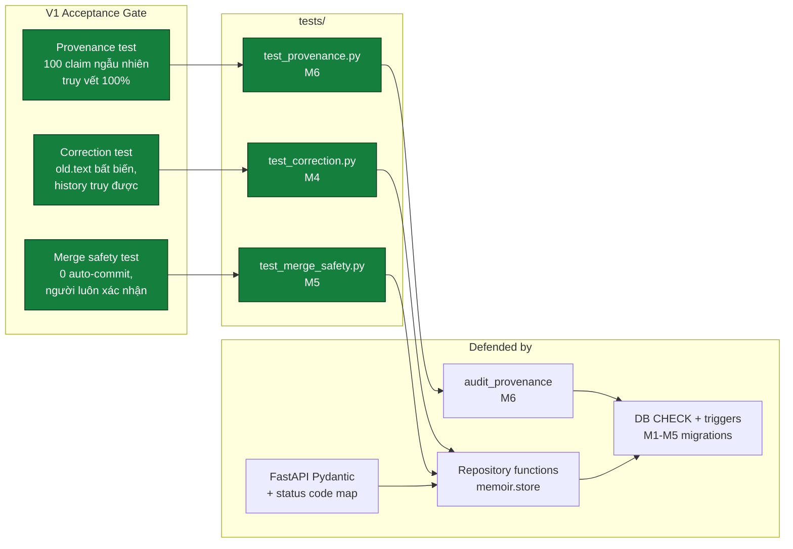

3/3 acceptance gate đang **PASS** trên `docker compose` Postgres. Corpus M6 test audit thực tế:

```
[M6] corpus: 158 total claims, status breakdown:
  pending=9, flagged=15, superseded=27, accepted=71, rejected=18, edited=18
```

149 reviewed claims → seeded `random.sample(100)` → `audit_provenance(c).ok` cho cả 100. Kèm full-corpus audit (149/149 OK) chứng minh không phải may rủi sample.

---

## 9. Append-only invariants — ai chặn cái gì

Bảng tham chiếu nhanh: với 1 row trong DB, ai sẽ chặn nếu code (hoặc operator) tìm cách thay đổi/xóa nó?

| Bảng | UPDATE | DELETE | TRUNCATE | Tại sao append-only |
|------|--------|--------|----------|---------------------|
| `sources` | — | — | — | (mutable; chỉ là metadata file) |
| `sessions` | — | — | — | (mutable; ít khi cập nhật) |
| **`utterances`** | trigger M1 | trigger M1 | (GRANT) | Substrate. §4 *"không bao giờ sửa"* |
| `claims` | function `_record_review` qua M3 actions | — | — | Mutation chỉ qua repo function viết audit |
| **`claim_sources`** | trigger M2 | trigger M2 | (GRANT) | Provenance một khi xác lập không di chuyển |
| `claim_entities` | — | — | — | (entity links có thể relabel) |
| `entities` | — | — | — | (canonical form có thể merge sau, không impl V1) |
| **`review_log`** | trigger M3 | trigger M3 | (GRANT) | Audit không bao giờ ghi đè; reversal = thêm row |

**Production note:** TRUNCATE bypass row-trigger theo thiết kế Postgres. Phòng vệ ở mức GRANT — production deploy nên `REVOKE TRUNCATE, UPDATE, DELETE ON utterances, claim_sources, review_log FROM <app_role>`. Conftest TRUNCATE giữa tests là quyền superuser dev DB, không phải production path.

---

## 10. Out of scope — gì ở V2

§2 README cố ý để lại. Nhắc lại ở đây vì sơ đồ trên có thể tạo ấn tượng "đã hoàn chỉnh":

- **Grounded generation** — sinh prose/chương; mọi câu phải cite `claim_id`, diff-able với verbatim source. Curated Memory Store của V1 là input cho đường này.
- **Auto-resolution of contradictions** — vẫn human-in-the-loop, V2 cũng vậy theo §9.
- **Ontology phong phú** — `claim_type` và `entities.kind` loose nhằm cho cấu trúc tự nổi lên.
- **Graph DB / external vector DB** — Postgres + pgvector đủ cho life-scale data; switch chỉ khi data scale ép buộc.
- **Multi-subject / fine-tuning / real-time** — không nằm trong V1.

---

*Cập nhật: M6 land. Mọi sơ đồ phản ánh code trên `master` sau khi merge PR #1–#7.*
